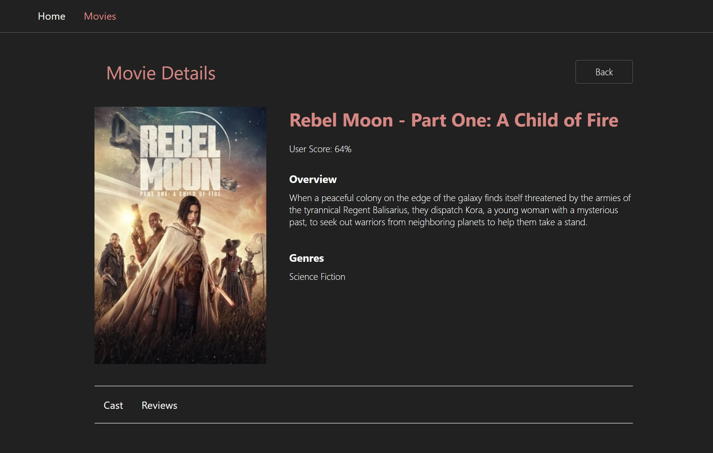
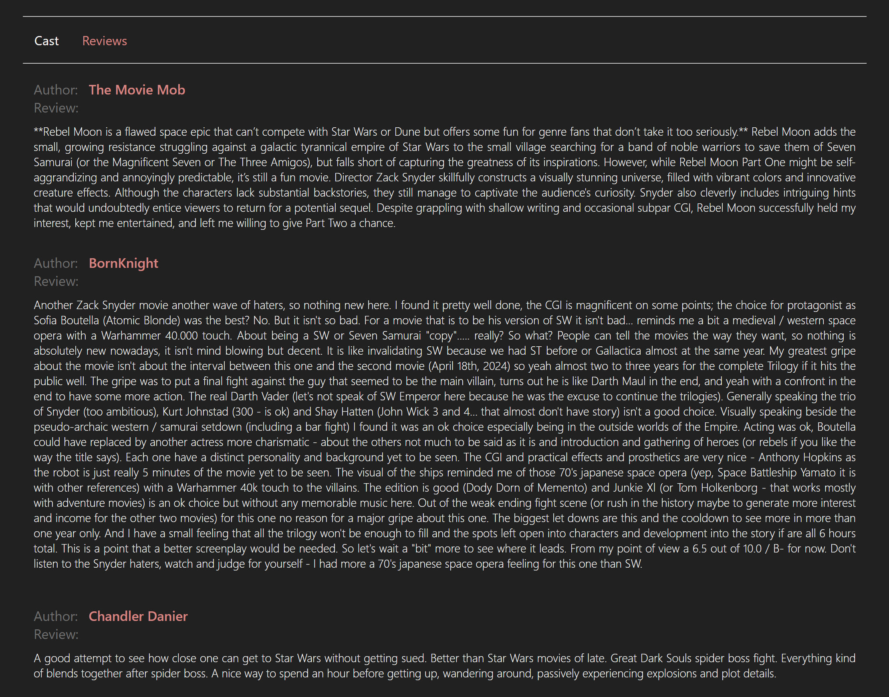
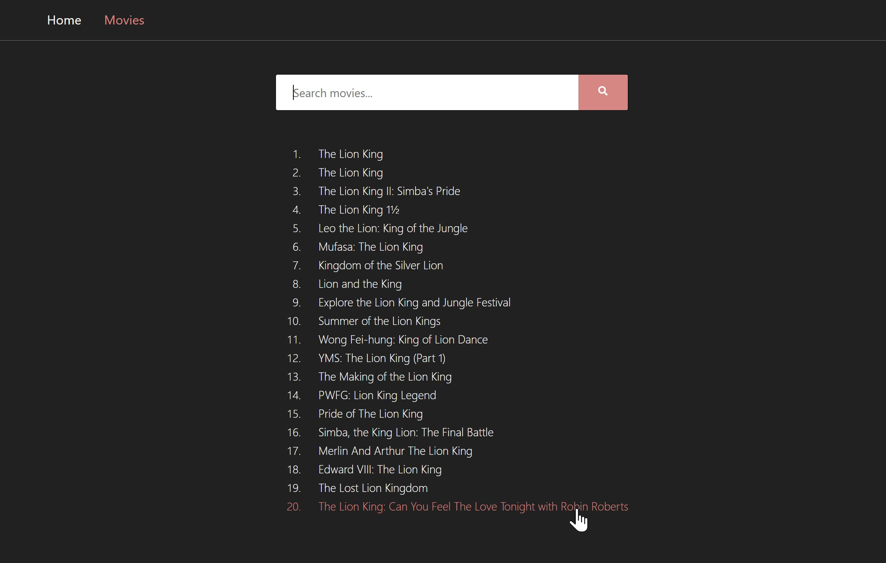

     

# React Movies

[Live Demo](https://olgatenison.github.io/goit-react-hw-05-movies/)

This project is a React application for searching and displaying movie
information. It uses the themoviedb.org API to fetch data about movies, actors,
and reviews.

## Project Structure

The project is structured as follows:

- **`src/`**: The source code of the React application.
  - **`components/`**: Reusable UI components.
    - **`Appbar.js`**: The top-level application bar.
    - **`Button.js`**: A button component.
    - **`Container.js`**: A container component for layout structure.
    - **`Navigation.js`**: Navigation component.
    - **`Searchbar.js`**: Search bar component.
    - **`PageTitle.js`**: Page title component.
    - **`MovieList.js`**: Component for displaying a list of movies.
    - **`MovieInfo/`**: Components related to movie information.
      - **`MovieInfoDetails.js`**: Component for displaying detailed movie
        information.
  - **`pages/`**: React components representing different pages of the
    application.
    - **`HomePage.js`**: Home page with trending movies.
    - **`MoviesPage.js`**: Page for searching and displaying movies.
    - **`MovieDetailsPage.js`**: Page for displaying detailed information about
      a specific movie.
      - **`Cast.js`**: Component for displaying information about the cast.
      - **`Reviews.js`**: Component for displaying movie reviews.
      - **`FullMovieInfo.js`**: Component for displaying full movie information.
  - **`services/`**: Functions for interacting with the themoviedb.org API. -
  **`api.js`**: API functions for fetching movie data.
  

       
  

## Project Requirements

### Acceptance Criteria

- Use this
  [React Homework Template](https://github.com/goitacademy/react-homework-template#readme)
  as a starting point for your program.
- Create a repository named `goit-react-hw-05-movies`.
- Provide a link to the source files and working pages of each project on GitHub
  Pages.
- Components store the minimal necessary set of data in their state; the rest is
  computed.
- No errors or warnings appear in the console during the execution of the
  assignment code.
- Each component has a separate folder with a React component file and a styles
  file.
- Everything a component expects as props is passed to it during the call.
- Component names are clear and descriptive.
- JS code is clean and understandable, using Prettier.
- Styling is done with CSS modules or Styled Components.

     

     

### themoviedb.org API

- Use the themoviedb.org API for the backend. Register (you can enter any data)
  and obtain an API key.
- The following endpoints will be used in this task:
  - `/trending/get-trending`: List of today's most popular movies to create a
    collection on the main page.
  - `/search/search-movies`: Movie search by keyword on the movies page.
  - `/movies/get-movie-details`: Request for full information about a movie for
    the movie details page.
  - `/movies/get-movie-credits`: Request for information about the cast for the
    movie details page.
  - `/movies/get-movie-reviews`: Request for reviews for the movie details page.

### Documentation Links

     

#### Routes

- The application should have the following routes. If a user enters a
  nonexistent route, they should be redirected to the home page.
  - `/`: Home component, home page with a list of popular movies.
  - `/movies`: Movies component, page for searching movies by keyword.
  - `/movies/:movieId`: MovieDetails component, page with detailed information
    about a movie.
    - `/movies/:movieId/cast`: Cast component, information about the cast.
      Rendered on the MovieDetails page.
    - `/movies/:movieId/reviews`: Reviews component, information about reviews.
      Rendered on the MovieDetails page.
